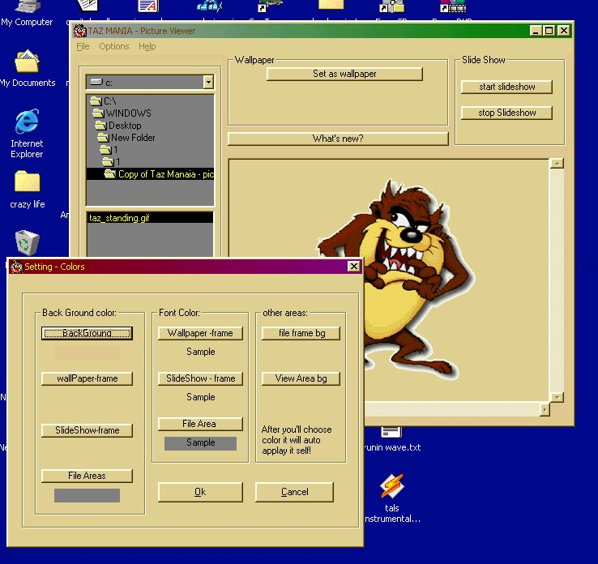



## TaZmAnIa 3\.5 \- final release\!\!\!\!

### Description

 PEOPLEE U GOTTA TRY THIS PROGRAM!!!!

 

 OK im glad to present the FINAL version of  TAZ-MANIA

 

 tazmania is a picture viewer which had is  first version about 6 months ago, and over  the time it got advenced. and it got from a  simpel picture viewer that only could view  some type of pictures.

 to very advenced one, whice can set pictures  as wallpaper, at the back of the desktop.

 u can watch slide shows, in the lil window.

 

 or all over the screen with the full screen  option.

 

 u can set the colors for the main part of the  program. and you can change the size of the  viewing area.

 

 what have change from vr. 2.2

 -=-=-=-=-=-=-=-=-=-=-=-=-=-=-=-

 

 full screen slide show.

 founded bugs were fixed

 3 more forms in which have : colors for the  main form, the full screan show, the slide  show properteis.

 and we changed the interface from the old one

 

 becuz i think the new interface is more  friendly then the old one

 

 PLZ VOTE FOR ME

 

 I WORKED ON THIS PROGREM FOR ALONG TIME

 AND NOW IM GIVING U THE COOD

 SO JUST PLZ VOTE FOR ME

 THANKS

 

 for comments, or anything else e-mail me at

 h_hotmail.com
 
### More Info
 

             |
---                |---
**Submitted On**   |2002-02-12 23:18:06
**By**             |[Motti Horesh](https://github.com/Planet-Source-Code/PSCIndex/blob/master/ByAuthor/motti-horesh.md)
**Level**          |Advanced
**User Rating**    |4.7 (33 globes from 7 users)
**Compatibility**  |VB 3\.0, VB 4\.0 \(16\-bit\), VB 4\.0 \(32\-bit\), VB 5\.0, VB 6\.0, VB Script, ASP \(Active Server Pages\) , VBA MS Access, VBA MS Excel
**Category**       |[Graphics](https://github.com/Planet-Source-Code/PSCIndex/blob/master/ByCategory/graphics__1-46.md)
**World**          |[Visual Basic](https://github.com/Planet-Source-Code/PSCIndex/blob/master/ByWorld/visual-basic.md)
**Archive File**   |[TaZmAnIa\_35499621220\.zip](https://github.com/Planet-Source-Code/motti-horesh-tazmania-3-5-final-release__1-31754/archive/master.zip)

